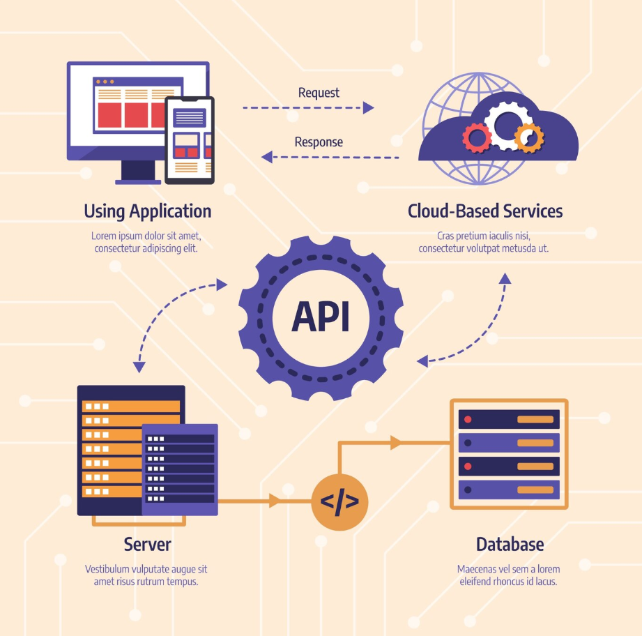

# RESTful API의 개념과 설계

## 1. REST 원칙 및 HTTP 메서드

### REST란?

REST(Representational State Transfer)는 웹 서비스를 위한 아키텍처 스타일로, 분산 시스템에서 자원을 **정의**하고 자원에 대한 **주소를 지정**하는 방법을 제공한다.



### REST의 6가지 원칙

#### 1. Uniform Interface (통일된 인터페이스)

- 자원의 식별: URI를 통한 자원 식별
- 표현을 통한 자원 조작: HTTP 메서드를 통한 자원 조작
- 자기 서술적 메시지: 메시지만으로 이해 가능
- HATEOAS: 애플리케이션 상태의 하이퍼미디어 엔진

#### 2. Client-Server (클라이언트-서버)

- 사용자 인터페이스와 데이터 저장소의 분리
- 클라이언트와 서버의 독립적 진화 가능

#### 3. Stateless (무상태)

- 각 요청은 독립적이며 서버는 클라이언트 상태를 저장하지 않음
- 요청에 필요한 모든 정보를 포함해야 함

#### 4. Cacheable (캐시 처리 가능)

- 응답은 캐시 가능하거나 불가능해야 함을 명시
- 성능과 확장성 향상

#### 5. Layered System (계층화 시스템)

- 시스템을 계층으로 구성 가능
- 중간 계층(프록시, 게이트웨이 등) 사용 가능

#### 6. Code-On-Demand (선택사항)

- 서버가 클라이언트에 실행 가능한 코드 전송 가능

### HTTP 메서드

#### GET

- **목적**: 자원 조회
- **특징**: 안전(Safe), 멱등(Idempotent)
- **예시**: `GET /users/123`

#### POST

- **목적**: 자원 생성
- **특징**: 안전하지 않음, 멱등하지 않음
- **예시**: `POST /users`

#### PUT

- **목적**: 자원 전체 수정/생성
- **특징**: 안전하지 않음, 멱등
- **예시**: `PUT /users/123`

#### PATCH

- **목적**: 자원 부분 수정
- **특징**: 안전하지 않음, 멱등하지 않음
- **예시**: `PATCH /users/123`

#### DELETE

- **목적**: 자원 삭제
- **특징**: 안전하지 않음, 멱등
- **예시**: `DELETE /users/123`

### HTTP 상태 코드

#### 2xx 성공

- `200 OK`: 성공
- `201 Created`: 생성 성공
- `204 No Content`: 성공, 응답 본문 없음

#### 4xx 클라이언트 오류

- `400 Bad Request`: 잘못된 요청
- `401 Unauthorized`: 인증 필요
- `403 Forbidden`: 권한 없음
- `404 Not Found`: 자원 없음

#### 5xx 서버 오류

- `500 Internal Server Error`: 서버 내부 오류
- `503 Service Unavailable`: 서비스 이용 불가

## 2. RESTful 엔드포인트 설계 방법

### 자원 중심 설계

RESTful API는 **자원(Resource)을 중심**으로 설계되어야 한다.

#### 좋은 예시

```
GET    /users          # 사용자 목록 조회
GET    /users/123      # 특정 사용자 조회
POST   /users          # 새 사용자 생성
PUT    /users/123      # 특정 사용자 전체 수정
PATCH  /users/123      # 특정 사용자 부분 수정
DELETE /users/123      # 특정 사용자 삭제
```

#### 나쁜 예시

```
GET    /getUsers       # 동사 사용 (X)
POST   /createUser     # 동사 사용 (X)
GET    /users?action=delete&id=123  # 쿼리로 액션 표현 (X)
```

### 계층적 자원 표현

중첩된 자원은 계층적으로 표현

```
GET    /users/123/posts           # 특정 사용자의 게시글 목록
GET    /users/123/posts/456       # 특정 사용자의 특정 게시글
POST   /users/123/posts           # 특정 사용자의 새 게시글 생성
DELETE /users/123/posts/456       # 특정 사용자의 특정 게시글 삭제
```

### 필터링, 정렬, 페이징

쿼리 파라미터를 활용하여 추가 기능을 제공

```
GET /users?page=1&limit=10                    # 페이징
GET /users?sort=name&order=asc                # 정렬
GET /users?status=active&role=admin           # 필터링
GET /users?fields=id,name,email               # 필드 선택
```

### 버전 관리

API 버전은 URL 경로나 헤더를 통해 관리

```
# URL 경로 방식
GET /api/v1/users
GET /api/v2/users

# 헤더 방식
GET /api/users
Accept: application/vnd.api+json;version=1
```

## 3. Express/MongoDB 기반 REST API 예제

### 프로젝트 설정

```bash
npm init -y
npm install express mongoose cors helmet morgan
npm install -D nodemon
```

### 기본 서버 설정

```javascript
// app.js
const express = require("express");
const mongoose = require("mongoose");
const cors = require("cors");
const helmet = require("helmet");
const morgan = require("morgan");

const app = express();
const PORT = process.env.PORT || 3000;

// 미들웨어
app.use(helmet());
app.use(cors());
app.use(morgan("combined"));
app.use(express.json());
app.use(express.urlencoded({ extended: true }));

// MongoDB 연결
mongoose.connect("mongodb://localhost:27017/restapi", {
  useNewUrlParser: true,
  useUnifiedTopology: true,
});

// 라우터 설정
app.use("/api/users", require("./routes/users"));

// 오류 처리 미들웨어
app.use((err, req, res, next) => {
  console.error(err.stack);
  res.status(500).json({ message: "Internal Server Error" });
});

app.listen(PORT, () => {
  console.log(`Server running on port ${PORT}`);
});
```

### 사용자 모델 정의

```javascript
// models/User.js
const mongoose = require("mongoose");

const userSchema = new mongoose.Schema(
  {
    name: {
      type: String,
      required: true,
      trim: true,
    },
    email: {
      type: String,
      required: true,
      unique: true,
      lowercase: true,
    },
    age: {
      type: Number,
      min: 0,
    },
    status: {
      type: String,
      enum: ["active", "inactive"],
      default: "active",
    },
  },
  {
    timestamps: true,
  }
);

module.exports = mongoose.model("User", userSchema);
```

### 사용자 컨트롤러

```javascript
// controllers/userController.js
const User = require("../models/User");

// 모든 사용자 조회
exports.getUsers = async (req, res) => {
  try {
    const { page = 1, limit = 10, sort = "name", order = "asc" } = req.query;
    const options = {
      page: parseInt(page),
      limit: parseInt(limit),
      sort: { [sort]: order === "desc" ? -1 : 1 },
    };

    const users = await User.find()
      .sort(options.sort)
      .limit(options.limit * 1)
      .skip((options.page - 1) * options.limit);

    const total = await User.countDocuments();

    res.json({
      users,
      totalPages: Math.ceil(total / options.limit),
      currentPage: options.page,
      total,
    });
  } catch (error) {
    res.status(500).json({ message: error.message });
  }
};

// 특정 사용자 조회
exports.getUserById = async (req, res) => {
  try {
    const user = await User.findById(req.params.id);
    if (!user) {
      return res.status(404).json({ message: "User not found" });
    }
    res.json(user);
  } catch (error) {
    res.status(500).json({ message: error.message });
  }
};

// 새 사용자 생성
exports.createUser = async (req, res) => {
  try {
    const user = new User(req.body);
    const savedUser = await user.save();
    res.status(201).json(savedUser);
  } catch (error) {
    if (error.name === "ValidationError") {
      return res.status(400).json({ message: error.message });
    }
    res.status(500).json({ message: error.message });
  }
};

// 사용자 전체 수정
exports.updateUser = async (req, res) => {
  try {
    const user = await User.findByIdAndUpdate(req.params.id, req.body, {
      new: true,
      runValidators: true,
    });
    if (!user) {
      return res.status(404).json({ message: "User not found" });
    }
    res.json(user);
  } catch (error) {
    if (error.name === "ValidationError") {
      return res.status(400).json({ message: error.message });
    }
    res.status(500).json({ message: error.message });
  }
};

// 사용자 부분 수정
exports.patchUser = async (req, res) => {
  try {
    const user = await User.findByIdAndUpdate(
      req.params.id,
      { $set: req.body },
      { new: true, runValidators: true }
    );
    if (!user) {
      return res.status(404).json({ message: "User not found" });
    }
    res.json(user);
  } catch (error) {
    if (error.name === "ValidationError") {
      return res.status(400).json({ message: error.message });
    }
    res.status(500).json({ message: error.message });
  }
};

// 사용자 삭제
exports.deleteUser = async (req, res) => {
  try {
    const user = await User.findByIdAndDelete(req.params.id);
    if (!user) {
      return res.status(404).json({ message: "User not found" });
    }
    res.status(204).send();
  } catch (error) {
    res.status(500).json({ message: error.message });
  }
};
```

### 라우터 설정

```javascript
// routes/users.js
const express = require("express");
const router = express.Router();
const userController = require("../controllers/userController");

// 사용자 관련 라우트
router.get("/", userController.getUsers);
router.get("/:id", userController.getUserById);
router.post("/", userController.createUser);
router.put("/:id", userController.updateUser);
router.patch("/:id", userController.patchUser);
router.delete("/:id", userController.deleteUser);

module.exports = router;
```

### 유효성 검사 미들웨어

```javascript
// middleware/validation.js
const { body, validationResult } = require("express-validator");

exports.validateUser = [
  body("name")
    .notEmpty()
    .withMessage("Name is required")
    .isLength({ min: 2 })
    .withMessage("Name must be at least 2 characters"),
  body("email").isEmail().withMessage("Valid email is required"),
  body("age")
    .optional()
    .isInt({ min: 0 })
    .withMessage("Age must be a positive integer"),
  (req, res, next) => {
    const errors = validationResult(req);
    if (!errors.isEmpty()) {
      return res.status(400).json({ errors: errors.array() });
    }
    next();
  },
];
```

### API 사용 예시

```bash
# 모든 사용자 조회
curl -X GET http://localhost:3000/api/users

# 특정 사용자 조회
curl -X GET http://localhost:3000/api/users/123

# 새 사용자 생성
curl -X POST http://localhost:3000/api/users \
  -H "Content-Type: application/json" \
  -d '{"name":"John Doe","email":"john@example.com","age":30}'

# 사용자 수정
curl -X PUT http://localhost:3000/api/users/123 \
  -H "Content-Type: application/json" \
  -d '{"name":"Jane Doe","email":"jane@example.com","age":25}'

# 사용자 삭제
curl -X DELETE http://localhost:3000/api/users/123
```

## 결론 및 요약

RESTful API는 웹 서비스의 표준적인 설계 방식으로, 명확한 원칙과 일관된 패턴을 따라 구현하면 유지보수가 쉽고 확장 가능한 API를 만들 수 있다. Express와 MongoDB를 활용하면 빠르고 효율적으로 RESTful API를 개발할 수 있으며, **적절한 오류 처리와 유효성 검사를 통해 안정적인 서비스를 제공.**
